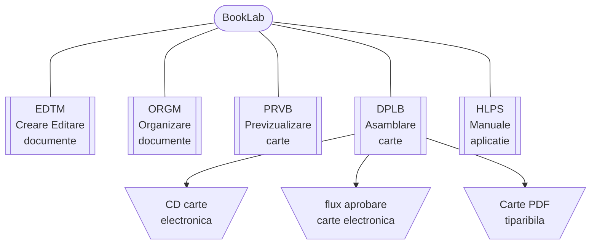

{ width="55" align=left }
<small markdown>**BookLab System** 
*(c) 2023 RENware Software Systems*
</small>      

# Vedere de ansamblu BookLab

***Cuprins:***

[TOC]

***

## Ce este BookLab

**BookLab** este un sistem destinat crearii de manuale cu diferite aplicabilitati. Cazurile tipice de utilizare sunt:

* documentatia unui produs: manuale de utilizare, fisa tehnica (data sheet)
* lectii si cursuri cu caracter didactic
* articole si note de specialitate (cu caracter didactic, tehnic sau comercial)
* proceduri de lucru pentru un sistem, produs, masina, utilaj, etc

Conceptul pe care este construit *BookLab* este acela de **carte** compusa din **sectiuni si capitole**. Acest concept isi gaseste reprezentarea in diferite domenii de activiate precum cele enumerate anterior, de exemplu:

* in cazul documentatiei unui produs aceasta este *cartea*
    * manualul de utilizare este o *sectiune* procedurile de lucru fiind *capitole* ale acestuia
    * manualul de depanare este o alta *sectiune* cu *capitolele* aferente
    * manualul de instalare si configurare este o alta *sectiune* cu *capitolele* aferente

* in cazul unui curs acesta este *cartea*
    * partea de prezentare teoretica este o *sectiune*, lectiile fiind *capitole* ale acestuia
    * partea de prezentare a "practicii" este o alta *sectiune* cu laboratoarele sau exercitiile *capitolele* aferente

!!! warning "modul vs componenta"
    <small markdown>termenii *modul* si *componenta* sunt utilizati cu acelasi sens in aceast document si pot fi interschimbate fara a altera sensul descrierii</small> 

## Structura si componenta BookLab

**BookLab** este compus din:

* **EDTM** - modul destinat crearii si editarii continutului efectiv al unui material

* **ORGM** - modul destinat organizari materialelor in diverse sectiuni, capitole, etc ai generarea "cuprinsului" (indexul general)

* **PRVB** - modul destinat previzualizarii si testarii materialelor realizate si a ansamblului acestora ("cartea" finala)

* **DPLB** - modul destinat asamblarii finale in forma electronica a "cartii" cu diferite optiuni:
    * sub forma de CD sau STICK USB pentru lectura offline (self peace learning)
    * trimitere intr-un alt sistem, de exemplu pe un flux de revizurire si aprobare
    * generarea unei variante complete de format PDF destinata tiparirii de exemplu

* **HLPS** - modulul de asistenta, help destimat accesarii manualelor aplicatiei

## Arhitectura logica structurala

<¡--

## Arhitectura functionala

#TODO continue ... 

-->

