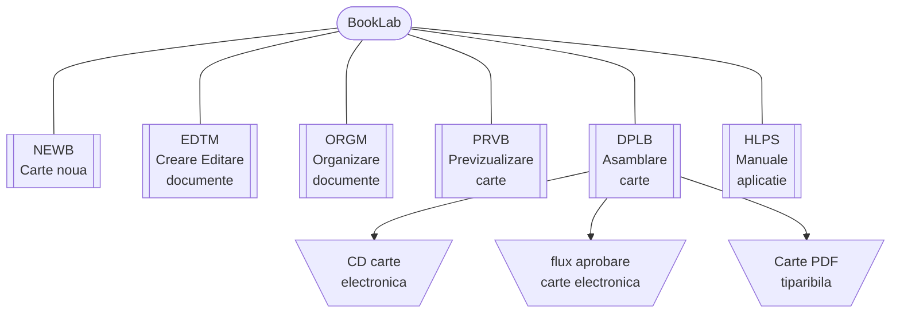

{ width="55" align=left }
<small markdown>**BookLab System**<br>
*(c) 2023 RENware Software Systems*
</small><br><br>


# Arhitectura sistemului


***Cuprins:***

[TOC]

***


## Introducere

Arhitectura sistemului pleaca de la structura de basa a acestuia, structura redata "pe scurt" mai jos. Diagrama putin mai elaborata dar cu descrierea componentelor se gaseste in [documentul `130.02-Overview.md`, sectiunea "Structura si componenta BookLab"](../help/130.02-Overview.md#structura-si-componenta-booklab) ce *se recomanda a fi citit* inainte de a incepe studiul acestuia, pentru o mai buna intelegere a lui.




>Referitor la *locatia fizica a componentelor* se face remarca ca toate componentele sistemului ce prezinta interfata vizuala cu utilizatorul au reprezentare atit in directorul `doc_src/` pentru partea de *front-end* (client side) cit si in radacina intregului sistem pentru partea de *back-end* (server-side).


!!! warning "Conceptele de server si client"
    Se atrage atentia asupra tratarii corecte din punct de vedere conceptual a notiunilor de ``server  si `clent`. Chiar daca locatia de instalare a sistemului nu pare "un server cu multi cai putere", arhitectura conceptuala de client-server este pe deplin implementata cu respectarea tuturor principiilor aferente si o consitentizare a acestui lucru va permite o intelegere corecta a detaliilor tehnice ale sistemului de catre echipa tehnica de lucru.


## Pornirea si initializarea sistemului

Pornirea sistemului comporta doua mari componente "on top", si anume:

* **serverul HTTP static** acesta va deservi partea de web compusa din "fisiere" statice. Acestea reprezinta fisierele HTML aferente interfetei UI dar si celelate fisiere "auxiliare" precum: CSS-uri, JS-uri, imagini, etc

* **serverul HTTP dinamic** ce opereaza in "background" (adica nu prezinta o interfata UI) si deserveste componentele care executa operatiile necesare (de ex create carte noua). Acest server este cunoscut si sub numele de `BookLab API`


### Serverul HTTP static

Acesta este un server HTTP tip *CGI* ce raspunde pe portul 80 (portul clasic, implicit pentru sisteme accesabile web).

!!! info "parametrii"
    * port: 80
    * nume: nume domeniu unde este publicat sistemul prefixat cu `booklab` (ca si hostname)
    * acces: public, deschis in extern
    * implentare: implicit `python http.server` sau `nginx`, `apache http`, etc pentru inplementari "on premises" folosind componentele clientului


### Serverul HTTP dinamic

Acesta este un server HTTP tip *WSGI* ce raspunde pe portul 7111.

!!! info "parametrii"
    * port: 7111
    * nume: numai `localhost`
    * acces: strict local, nedeschis
    * implentare: implicit `gunicorn` sau `nginx wsgi`, `apache uwsgi` pentru inplementari "on premises" folosind componentele clientului


-#TODO... 


## NEWB creare carte noua

-#TODO... 


## EDTM preluare si editare continut

-#TODO... 


## ORGM organizare structura carte

-#TODO... 


## PRVB previzualizare si testare carte

-#TODO... 


## DPLB asamblare publicare carte

-#TODO... 


## HLPS help asistenta si manuale

-#TODO... 


-#TODO_wip_for_## BookLab deployed application book template directory

-#NOTE exista un doc dedicat application directory...


-#NOTE: this is all tree from project root - keep what you need

```tree

PROJECT_ROOT
|   bkcmd_new_book.py
|   CNAME
|   index.md
|   print_page.md
|   wip.md
|   
+---810-DSGN
|       .gitkeep
|       810.02-System_Landscape.md
|       
+---bk_tmpl
|   |   .gitkeep
|   |   bkcmd_gen_final_book.py
|   |   bkcmd_start_book_preview.py
|   |   bk_CNAME_domain
|   |   mkdocs.yml.new_name
|   |   
|   +---doc_src
|   |       CNAME
|   |       index.md
|   |       print_page.md
|   |       readme_and_keep_me.txt
|   |       
|   \---my_book
|           readme_and_keep_me.txt
|           
+---help
|       .gitkeep
|       130.02-Overview.md
|       880.30-ADMA_catalog.md
|       880.30-EUMA_catalog.md
|       
\---pictures
        booklab_logo.png
        REN_stamp_logo_transparent.fodg
        REN_stamp_logo_transparent.png
        REN_stamp_logo_transparent.svg
        under_maintenance.png


```


