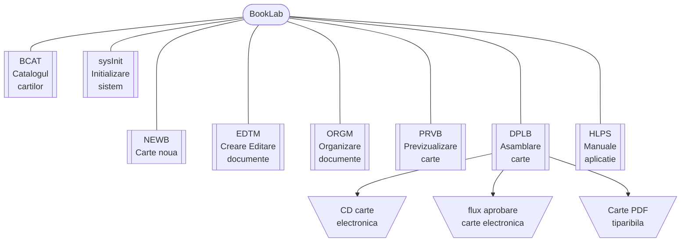

{ width="55" align=left }
<small markdown>**BookLab System**<br>
*(c) 2023 RENware Software Systems*
</small><br><br>


# Arhitectura sistemului


***Cuprins:***

[TOC]

***


## Introducere

Arhitectura sistemului pleaca de la structura de basa a acestuia, structura redata "pe scurt" mai jos. Diagrama putin mai elaborata dar cu descrierea componentelor se gaseste in [documentul `130.02-Overview.md`, sectiunea "Structura si componenta BookLab"](../help/130.02-Overview.md#structura-si-componenta-booklab) ce *se recomanda a fi citit* inainte de a incepe studiul acestuia, pentru o mai buna intelegere a lui.




>Referitor la *locatia fizica a componentelor* se face remarca ca toate componentele sistemului ce prezinta interfata vizuala cu utilizatorul au reprezentare atit in directorul `docs/` pentru partea de *front-end* (client side) cit si in radacina intregului sistem pentru partea de *back-end* (server-side). <small>(Directorul `docs/` este generat prin compilarea aplicatiei in faza de development din directorul `doc_src/`.)</small>


!!! warning "Conceptele de server si client"
    * Se atrage atentia asupra tratarii corecte din punct de vedere conceptual a notiunilor de `server`  si `client`. 
    * Chiar daca locatia de instalare a sistemului nu pare "un server cu multi cai putere", arhitectura conceptuala de client-server este pe deplin implementata cu respectarea tuturor principiilor aferente si o consitentizare a acestui lucru va permite o intelegere corecta a detaliilor tehnice ale sistemului de catre echipa tehnica de lucru.
    * Locatiile fizice ale componentelor sunt prezentate NUMAI pentru _partea de SERVER_.
    * Locatiile pentru _partea de CLIENT_ sunt situate dupa o organizare clasica de site static incepind din directorul `docs/` iar codul este prezent in fisier `*.html` (in rare cazuri pot fi mai multe dar incep cu acelasi prefix).
    * In general (daca nu specifica in clar altfel) `code-name` al componentelor este acelasi atit pentru SERVER cit si pentru CLIENT. Diferentierea intre acestea se intimpla deoarece raspund servere diferite pentru porturile aferente (80 client si 4111 server). Astfel pe ruta "normala" a unei componente, de ex ptr *NEWB*: `http://booklab.../newb` va raspunde intii componenta CLIENT (prezenta sub forma unui `index.html` in directorul `docs/newb/`).


## sysInit Initializare sistem

Pornirea sistemului comporta doua mari componente "on top", si anume:

* **serverul HTTP static** acesta va deservi partea de web compusa din "fisiere" statice. Acestea reprezinta fisierele HTML aferente interfetei UI dar si celelate fisiere "auxiliare" precum: CSS-uri, JS-uri, imagini, etc

* **serverul HTTP dinamic** ce opereaza in "background" (adica nu prezinta o interfata UI) si deserveste componentele care executa operatiile necesare (de ex create carte noua). Acest server este cunoscut si sub numele de `BookLab API`

!!! info "parametrii"
    * _code-name_: `sysInit`
    * _SERVER locatie_: `sysInit/`
    * _Documentul descriere detaliat_: [`810.05a-sysInit_System_Process.md`](810.05a-sysInit_System_Process.md)


## BCAT catalogul cartilor

Acest modul este responsabil de catalogul (lista) cartilor si de sablonul de creare a unei carti. Astfel el contine urmatoarele elemente:

* **sablonul** implicit de creare a unei carti noi (si singurul in versiunea 1 a aplicatiei). Datele acestui sablon se afla in subdirectorul `bk_tmpl/`.

* **catalogul cartilor** ce este baza de date cu informatiile de baza despre carti. Acest catalog contine informatiile necesare pentru identificarea si referentierea unei carti in aplicatie. *Datele detaliate* aferente unei carti se gasesc in directorul aferent acesteia, director al carui nume se regaseste in acest catalog. Catalogul este stocat in format `JSON` si se gaseste in fisierul `books_catalog.json`.

!!! info "parametrii"
    * _code-name_: `bcat`
    * _SERVER locatie_: `books_metainfo/`
    * _CLIENT locatie_: `docs/bcat/index.html` (`doc_src/index.md` before 1-st compilation)
    * _Documentul descriere detaliat_: [`810.05a-bcat_System_Process.md`](810.05a-bcat_System_Process.md)


## NEWB creare carte noua

-#TODO... { width="200" }

!!! info "parametrii"
    * _code-name_: `newb`
    * _SERVER locatie_: `newb/`
    * _Documentul descriere detaliat_:[810.05a-newb_System_Process.md](810.05a-newb_System_Process.md)


## EDTM preluare si editare continut

-#TODO... { width="200" }

!!! info "parametrii"
    * _code-name_: `edtm`
    * _SERVER locatie_: `edtm/`
    * _Documentul descriere detaliat_: [`810.05a-edtm_System_Process.md`](810.05a-edtm_System_Process.md)


## ORGM organizare structura carte

-#TODO... { width="200" }

!!! info "parametrii"
    * _code-name_: `orgm`
    * _SERVER locatie_: `orgm/`
    * _Documentul descriere detaliat_: [`810.05a-orgm_System_Process.md`](810.05a-orgm_System_Process.md)


## PRVB previzualizare si testare carte

-#TODO... { width="200" }

!!! info "parametrii"
    * _code-name_: `prvb`
    * _SERVER locatie_: `prvb/`
    * _Documentul descriere detaliat_: [`810.05a-prvb_System_Process.md`](810.05a-prvb_System_Process.md)


## DPLB asamblare publicare carte

-#TODO... { width="200" }

!!! info "parametrii"
    * _code-name_: `dplb`
    * _SERVER locatie_: `dplb/`
    * _Documentul descriere detaliat_: [`810.05a-dplb_System_Process.md`](810.05a-dplb_System_Process.md)


## HLPS help asistenta si manuale

Manuale aplicatiei sunt de doua feluri (categorii) majore:

* **Manuale de utilizare**, acestea prezinta informatii pentru utilizarea curenta a aplicatiei. Catalogul acestora se poate accesa de la [`<SERVER NAME>/help/880.30-EUMA_catalog.html`](../help/880.30-EUMA_catalog.md).

* **Manuale de configurare**, acestea prezinta informatii pentru configurarea aplicatiei. Catalogul acestora se poate accesa de la [`<SERVER NAME>/help/880.30-ADMA_catalog.html`](../help/880.30-ADMA_catalog.md).

Pentru ambele tipuri de manuale se va prezenta un *catalog* ce contine lista tuturor manualelor disponibile in acea categorie. Lista contine numele manualului, o scurta descriere (daca numele nu este suficient de elocvent) si linkul catre manualul respectiv.

Manualele sunt localizate in sectiunea statica a aplicatiei (vezi si sectiunea ["Serverul HTTP static"](#serverul-http-static)) in directorul *`docs/help/`*.


## #TODO section and work scratches

-#TODO_wip_for_## BookLab deployed application book template directory

-#NOTE exista un doc dedicat application directory...

-#NOTE: this is all tree from all project `docs_src/` - keep what you need abd clean characters (just let indents) to work `tree` extension

```tree

PROJECT_ROOT/
|   .gitkeep
|   bkcmd_new_book.py
|   CNAME
|   index.md
|   print_page.md
|   requirements.txt.ck_if_need_it
|   wip.md
|
+---810-DSGN/
|       .gitkeep
|       810.02-System_Landscape.md
|
+---bk_tmpl/
|   |   .gitkeep
|   |   bkcmd_gen_final_book.py
|   |   bkcmd_start_book_preview.py
|   |   bk_CNAME_domain
|   |   mkdocs.yml.new_name
|   |
|   +---my_book/
|   |       readme_and_keep_me.txt
|   |
|   +---preview_book/
|   |       .gitkeep
|   |
|   \---raw_source_docs/
|           CNAME
|           index.md.txt
|           print_page.md.txt
|           readme_and_keep_me.txt
|
+---help/
|       .gitkeep
|       130.02-Overview.md
|       880.30-ADMA_catalog.md
|       880.30-EUMA_catalog.md
|
\---pictures/
        booklab_logo.png
        REN_stamp_logo_transparent.fodg
        REN_stamp_logo_transparent.png
        REN_stamp_logo_transparent.svg
        under_maintenance.png


```


