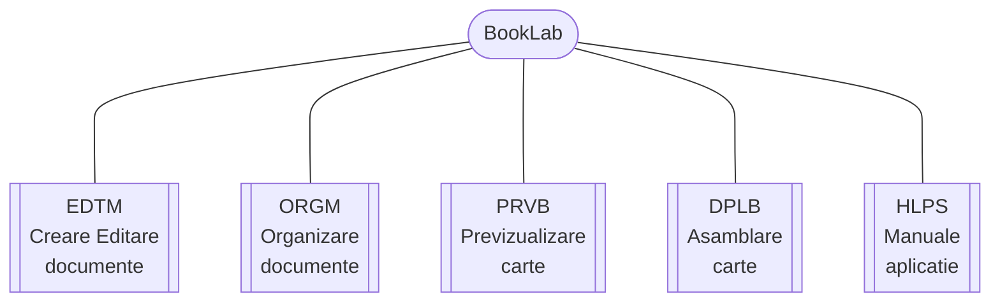

{ width="55" align=left }
<small markdown>**BookLab System** 
*(c) 2023 RENware Software Systems*
</small>      

# Arhitectura sistemului

***Cuprins:***

[TOC]

***

## Introducere

Arhitectura sistemului pleaca de la structura de basa a acestuia, structura redata "pe scurt" mai jos. Diagrama putin mai elaborata dar cu descrierea componentelor se gaseste in [documentul `810-DSGN-130.02-Overview.md`, sectiunea "Structura si componenta BookLab"](./810-DSGN-130.02-Overview.md#structura-si-componenta-booklab) ce *se recomanda a fi citit* inainte de a incepe studiul acestuia, pentru o mai buna intelegere a lui.

## ...

 