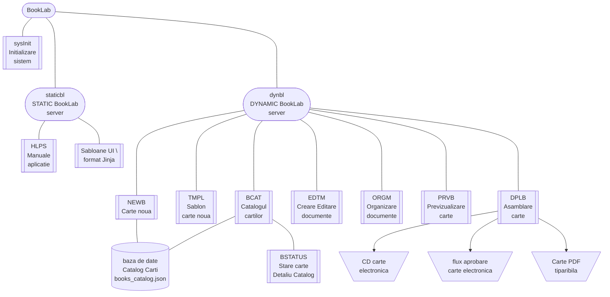

{ width="55" align=left }
<small markdown>**BookLab System** 
*(c) 2023 RENware Software Systems*
</small>  

# Arhitectura sistemului

***Cuprins:***

[TOC]

***

## Introducere

!!! note "Arhitectura sistemului prezinta in sectiunile urmatoare"
    * descrierea proceselelor sistemului
    * descrierea componentelor sistemului (numite de multe ori module cu intelegere sinonima)
    * o scurta decsriere referitoare la organizarea aplicatiei software

## Procesele sistemului

!!! note "Procesele sistemului"
    * Procese administrative:
        * Carte noua (*cod-name*: `NEWB`)
        * Organizare carte (*cod-name*: `ORGM`)
        * Asamblare carte (*cod-name*: `DPLB`)
    * Procese de realizare:
        * Editare carte (*cod-name*: `EDTM`)
        * Previzualizare carte (*cod-name*: `PRVB`)

*Procesele administrative* permit crearea si organizarea unei carti iar *procesele de realizare* permit realizare / editarea unei carti.

>NOTA: O descriere sumara a proceselelor sistemului se gaseste si in [documentul `130.02-Overview.md`, sectiunea "Structura si componenta BookLab"](../help/130.02-Overview.md#structura-si-componenta-booklab).

### Corelarea proceselor cu componentele sistemului

In continuare se prezinta o matrice privind utilizarea componentelor (modulelor) sistemului de catre procesele enumerate anterior:

| Componenta | Carte noua | Organizare carte | Asamblare carte | Editare carte | Previzualizare carte |
| :--------- | :-----------: | :-----------------: | :----------------: | :--------------: | :---------------------: |
| `BCAT`     |   &#10004;    |      &#10004;       |      &#10004;      |     &#10004;     |                         |
| `TMPL`     |   &#10004;    |                     |                    |                  |                         |
| `NEWB`     |   &#10004;    |                     |                    |                  |                         |
| `EDTM`     |               |                     |                    |     &#10004;     |                         |
| `ORGM`     |               |      &#10004;       |                    |                  |                         |
| `PRVB`     |   &#10004;    |      &#10004;       |      &#10004;      |     &#10004;     |        &#10004;         |
| `DPLB`     |               |                     |      &#10004;      |                  |                         |

## Componentele si modulele sistemului

Diagrama urmatoare reda modulele / componentele sistemului. Acestea sunt folosite de catre [procesele acestuia](#procesele-sistemului). (Diagrama putin mai elaborata dar cu descrierea componentelor se gaseste in [documentul `130.02-Overview.md`, sectiunea "Structura si componenta BookLab"](../help/130.02-Overview.md#structura-si-componenta-booklab) ce *se recomanda a fi citit* inainte de a incepe studiul acestuia, pentru o mai buna intelegere a lui.)





>Referitor la *locatia fizica a componentelor* se face remarca ca toate componentele sistemului ce prezinta interfata vizuala cu utilizatorul au reprezentare atit in directorul `docs/` pentru partea de *front-end* (client side) cit si in radacina intregului sistem pentru partea de *back-end* (server-side). <small>(Directorul `docs/` este generat prin compilarea aplicatiei in faza de development din directorul `doc_src/`.)</small>

!!! warning "Conceptele de server si client"
    * Se atrage atentia asupra tratarii corecte din punct de vedere conceptual a notiunilor de `server`  si `client`. Arhitectura conceptuala de client-server este pe deplin implementata cu respectarea tuturor principiilor aferente si o consitentizare a acestui lucru va permite o intelegere corecta a detaliilor tehnice ale sistemului de catre echipa tehnica de lucru.
    * In general in toata documentatia produsului prin termenul *CLIENT* se va intelege si partea de *CLIENT FRONTEND* iar prin cea de *SERVER* si partea de *SERVER BACKEND*.
    * Locatiile pentru _partea de server static_ (componenta **`staticbl`**) sunt situate dupa o organizare clasica de site static incepind din directorul `docs/` iar codul "de start" este prezent in fisierul `index.html` (presupunind ca la utilizarea unui HTTP server anume la dorinta clientului, acesta este configurat sa functioneze asa in lipsa specificarii unui fisier in rutele URL).
    * In general (daca nu specifica in clar altfel) `code-name` al componentelor este acelasi atit pentru SERVER cit si pentru CLIENT. Diferentierea intre acestea se intimpla deoarece raspund servere diferite pentru porturile aferente (80 client si 4111 server). Astfel pe ruta "normala" a unei componente, de ex ptr *NEWB*: `http://booklab.../newb` va raspunde intii componenta CLIENT (prezenta sub forma unui `index.html` in directorul `docs/newb/`).

### sysInit Initializare sistem

Pornirea sistemului comporta doua mari componente "on top", si anume:

* **`staticbl`** - **STATIC BookLab** *serverul HTTP static* acesta va deservi partea de web compusa din "fisiere" statice. Acestea reprezinta fisierele HTML aferente interfetei UI dar si celelate fisiere "auxiliare" precum: CSS-uri, JS-uri, imagini, etc

* **`dynblsrv`** - **DYNAMIC BookLab** *serverul WSGI dinamic* ce permite rularea de scripturi Python server-side si deserveste componentele care executa operatiile necesare (de ex create carte noua). Acest server este cunoscut si sub numele de `BookLab API`

De asemenea referitor la initializarea sistemului trebuie spus si ca ***prima instalare a acestuia*** se face cu o serie de programe / scripturi. Nu se intra in detalii deoarece procedura de instalare a sistemului este una cit se poate de clasica pentru instalarile executate manual pe sisteme Linux iar pentru sisteme Windows acesta este tot una clasica, cu un simplu wizard "standardizat" si care executa scrierea in toate locatiile necesare (ex Registry).

!!! info "parametrii"
    * _code-name_: `sysInit`
    * _locatie DYNAMIC BookLab_: `sysInit/`
    * _locatie script PRIMA INSTALARE_: `setup/`
    * _Document descriere detaliata_: [`810.05a-sysInit_System_Process.md`](810.05a-sysInit_System_Process.md)

### BCAT catalogul cartilor

Acest modul este responsabil de catalogul (lista) cartilor si de sablonul de creare a unei carti. Astfel el contine urmatoarele elemente:

* **catalogul cartilor** ce este baza de date cu informatiile de baza despre carti. Acest catalog contine informatiile necesare pentru identificarea si referentierea unei carti in aplicatie. *Datele detaliate* aferente unei carti se gasesc in directorul aferent acesteia, director al carui nume se regaseste in acest catalog. Catalogul este stocat in format `JSON` si se gaseste in fisierul `books_catalog.json`.

* **interfata UI "Catalog carti"** ce este interfata CLIENT-UI[^1] pentru managementul catalogului cartilor oferind operatii tip CRUD asupra bazei de date cu catalogul cartilor.

!!! info "parametrii"
    * _code-name_: `bcat`
    * _locatie DYNAMIC BookLab_: `docs/data/` cu baza de date catalogul cartilor `books_catalog.json`
    * _locatie STATIC BookLab_: `docs/bcat/index.html` (`doc_src/index.md` before 1-st compilation)
    * _Document descriere detaliata_: [`810.05a-bcat_System_Process.md`](810.05a-bcat_System_Process.md)

### TMPL sablon carte noua

 Aceasta componenta refera **sablonul** implicit de creare a unei carti noi (si singurul in versiunea 1 a aplicatiei). Fisierele asociate acestui sablon se afla in subdirectorul `book_tmpl/`.

!!! info "parametrii"
    * _code-name_: `book_tmpl`
    * _locatie template carte_: `docs/book_tmpl/`
    * _Document descriere detaliata_: [810.05a-btmpl_System_Process.md](810.05a-btmpl_System_Process.md)

### NEWB creare carte noua

-#TODO... { width="200" }

!!! info "parametrii"
    * _code-name_: `newb`
    * _locatie DYNAMIC BookLab_: `newb/`
    * _locatie STATIC BookLab_: ...nestabilit inca... <!-- #TODO... de stabilit clar si concret  -->
    * _Document descriere detaliata_: [810.05a-newb_System_Process.md](810.05a-newb_System_Process.md)

### EDTM preluare si editare continut

-#TODO... { width="200" }

!!! info "parametrii"
    * _code-name_: `edtm`
    * _locatie DYNAMIC BookLab_: `edtm/`
    * _locatie STATIC BookLab_: ...nestabilit inca... <!-- #TODO... de stabilit clar si concret  -->
    * _Document descriere detaliata_: [`810.05a-edtm_System_Process.md`](810.05a-edtm_System_Process.md)

### ORGM organizare structura carte

-#TODO... { width="200" }

!!! info "parametrii"
    * _code-name_: `orgm`
    * _locatie DYNAMIC BookLab_: `orgm/`
    * _locatie STATIC BookLab_: ...nestabilit inca... <!-- #TODO... de stabilit clar si concret  -->
    * _Document descriere detaliata_: [`810.05a-orgm_System_Process.md`](810.05a-orgm_System_Process.md)

### PRVB previzualizare si testare carte

-#TODO... { width="200" }

!!! info "parametrii"
    * _code-name_: `prvb`
    * _port for ruuning HTTP preview server_: `8111` (DIFFERENT than 80 which is reserved for main application)
    * _locatie DYNAMIC BookLab_: `prvb/`
    * _locatie STATIC BookLab_: ...nestabilit inca... <!-- #TODO... de stabilit clar si concret  -->
    * _Document descriere detaliata_: [`810.05a-prvb_System_Process.md`](810.05a-prvb_System_Process.md)

### DPLB asamblare publicare carte

-#TODO... { width="200" }

!!! info "parametrii"
    * _code-name_: `dplb`
    * _locatie DYNAMIC BookLab_: `dplb/`
    * _locatie STATIC BookLab_: ...nestabilit inca... <!-- #TODO... de stabilit clar si concret  -->
    * _Document descriere detaliata_: [`810.05a-dplb_System_Process.md`](810.05a-dplb_System_Process.md)

### HLPS help asistenta si manuale

Manuale aplicatiei sunt de doua feluri (categorii) majore:

* **Manuale de utilizare**, acestea prezinta informatii pentru utilizarea curenta a aplicatiei. Catalogul acestora se poate accesa de la [`<SERVER NAME>/help/880.30-EUMA_catalog.html`](../help/880.30-EUMA_catalog.md).

* **Manuale de configurare**, acestea prezinta informatii pentru configurarea aplicatiei. Catalogul acestora se poate accesa de la [`<SERVER NAME>/help/880.30-ADMA_catalog.html`](../help/880.30-ADMA_catalog.md).

Pentru ambele tipuri de manuale se va prezenta un *catalog* ce contine lista tuturor manualelor disponibile in acea categorie. Lista contine numele manualului, o scurta descriere (daca numele nu este suficient de elocvent) si linkul catre manualul respectiv.

Manualele sunt localizate in sectiunea statica a aplicatiei (vezi si sectiunea ["Serverul HTTP static"](#serverul-http-static)) in directorul *`docs/help/`*.

## Organizarea aplicatiei software

<small>Cod document metodologic: `810.05b Application Software Organization`</small>

In principiu aplicatia (sistemul) este organizata pe principiul _directoarelor de fisiere_. Aceasta permite o "rapida" regasire si recunoastere a informatiilor necesare chiar de la nivelul sistemului de operare (fara a necesita instrumente speciale ci doar comenzile existente in sistemul de operare). De asemena o astfel de organizare este foarte apropiata de standardele clasice / originale ale aplicatiilor web.

Directoarele principale ale aplicatiei sunt enumerate la fiecare componenta din arhitectura si nu necesita explicatii suplimentare fata de cele scrise deja (vezi sectiunea [Arhitectura sistemului](#introducere)). Detalii privind structura interna a fiecarui director aferent unei componente se regasesc in documentul de descriere detaliata aferent acelei componente. In situatii in care s-au considerat necesare diferite detelii pur specifice si "locale", in directorul componentei respective se gaseste un fisier `README_<cod-name componenta>.md` ce prezinta aceste lucruri. Aceste documente se adreseaza in special dezvoltarilor aplicatiei (dar nu in mod obligatoriu) iar ca exemplu de ce poate contine un astfel de fisier este prezentarea modalitatii de pregatire a mediului local pentru dezvoltare.

## Note

[^1]: UI - desemneaza in general "Interfata Utilizator" (engl: User Interface) grafica, interactiva ce este afisata de catre browser (sau alta aplicatie GUI de acces)

