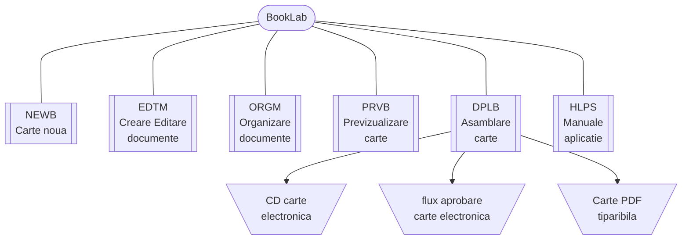

{ width="55" align=left }
<small markdown>**BookLab System** 
*(c) 2023 RENware Software Systems*
</small>  

# Vedere de ansamblu BookLab

***Cuprins:***

[TOC]

***

## Ce este BookLab

**BookLab** este un sistem destinat crearii de manuale cu diferite aplicabilitati. Cazurile tipice de utilizare sunt:

* documentatia unui produs: manuale de utilizare, fisa tehnica (data sheet)
* lectii si cursuri cu caracter didactic
* articole si note de specialitate (cu caracter didactic, tehnic sau comercial)
* proceduri de lucru pentru un sistem, produs, masina, utilaj, etc
* documentatia rezultata in urma implementarii unui proiect (pentru a fi accesibila tuturor utilizatorilor in format electronic sau a putea fi "anexata" ca HELP al sistemului sau ca HELP GENERAL al beneficiarului)

Conceptul pe care este construit *BookLab* este acela de **carte** compusa din **sectiuni si capitole**. Acest concept isi gaseste reprezentarea in diferite domenii de activiate precum cele enumerate anterior, de exemplu:

* in cazul documentatiei unui produs aceasta este *cartea*
    * manualul de utilizare este o *sectiune* procedurile de lucru fiind *capitole* ale acestuia
    * manualul de depanare este o alta *sectiune* cu *capitolele* aferente
    * manualul de instalare si configurare este o alta *sectiune* cu *capitolele* aferente

* in cazul unui curs acesta este *cartea*
    * partea de prezentare teoretica este o *sectiune*, lectiile fiind *capitole* ale acestuia
    * partea de prezentare a "practicii" este o alta *sectiune* cu laboratoarele sau exercitiile *capitolele* aferente

!!! warning "modul vs componenta"
    <small markdown>termenii *modul* si *componenta* sunt utilizati cu acelasi sens in aceast document si pot fi interschimbate fara a altera sensul descrierii</small> 

## Referinte si exemple de utilizare

Exemple de cum a fost folosit **BookLab in diverse proiecte**:

* [manual si proceduri vizind o metodologie de lucru](http://sdeven.renware.eu) (copyright RENware Software Systems)
* [documentatie de produs](http://nexgenai.app) (copyright Connections)

## Structura si componenta BookLab

**BookLab** este compus din:

* **NEWB** - functionalitatile destinata crearii unei carti noi

* **EDTM** - modul destinat crearii si editarii continutului efectiv al unui material sau a incarcarii materialului din fisier extern

* **ORGM** - modul destinat organizari materialelor in diverse sectiuni, capitole, etc ai generarea "cuprinsului" (indexul general)

* **PRVB** - modul destinat previzualizarii si testarii materialelor realizate si a ansamblului acestora ("cartea" finala)

* **DPLB** - modul destinat asamblarii finale in forma electronica a "cartii" cu diferite optiuni:
    * sub forma de CD sau STICK USB pentru lectura offline (self peace learning)
    * trimitere intr-un alt sistem, de exemplu pe un flux de revizurire si aprobare
    * generarea unei variante complete de format PDF destinata tiparirii de exemplu

* **HLPS** - modulul de asistenta, help destimat accesarii manualelor aplicatiei

## Arhitectura structurala

## Continutul materialelor

Din punct de vedere al continutului materialelor acesta poate fi:

!!! info "text"
    * text (simplu, ingrosat-bold, cursiv-italic, micsorat-small)
    * casete distinctive cu simbol grafic destinate notelor, informatiilor, indicatiilor, avertizarilor, erorilor, etc
    * titlul materialului si titluri se sectiuni (max 6 nivele)
    * legaturi (link) catre sectiuni ale aceluisi material sau catre sectiuni din alte materiale
    * cuprins generat automat ce referentiaza indentat si cu link titlurile sectiunilor

!!! info "formule matematice"
    * formule, ecuatii si sisteme de ecuatii de orice complexitate
    * simboluri matematice specifice (ex integrala, suma, derivata, etc)
    * indecsi si puteri (text subunitar sau supranitar)
    * caractere din alfabetul gresesc curent utilizate in matematica
    * fractii, radicali, serii, siruri, sume, produse, multimi, matrice, etc

!!! info "imagini"
    * orice format uzual tip rastru (bitmap)
    * formate vectoriale de uz comun SVG, PNG, etc (nu dedicate unor peoduse anume)
    * aplicarea unei scalari, de obicei prin specificarea latimii maximale admise, scalarea rezultata pastrind proportiile initiale
    * "impunerea" unei alinieri stinga / dreapta cu permiterea "curgerii" textului inconjurator

!!! info "tabele"
    * tabele cu cap de tabel si continut aliniabil stinga, dreapta, centrat
    * diverse semne speciale gen "bifa vazut", "bifa taiat", etc
    * preluarea dateloe din chiar textul materialului sau din fisiere specifice (ex Excel, CSV, format fix, etc)

!!! info "grafice"
    * orice model uzual de gtafic (pie chart, bar, polar, line, etc)
    * preluarea datelor de afisat din chiar textul materialului sau din fisiere specifice (ex Excel, CSV, format fix, etc)
    * stabilirea culorilor si a factorului de scalare
    * cititorii pot deplasa (pan) sau mari (zoom) graficul pentru vizionarea zonelor ce nu se vad datorita scalarii

!!! info "simulari"
    * programe scrise si interactive, incluse in materiale impreuna cu celelalte elemente, programe ce se executa la accesarea, parcurgerea materialului sau apasarea unui control
    * limbajele de programare uzuale si cunoscute (ex Python, Fortran, C, Basic, etc) sunt incluse in pachetl aplicatiei dar cu pos8bilitateacl de a instala orice alt limbaj de programare (lista contine peste 200 de limbaje)

!!! info "teste"
    * test simple de tip "autotestare" cu raspunsuri predefinite
    * testele sunt incluse in material impreuna cu celelalte elemente, adica nu trebuie creata o sectiune speciala

!!! info "filme video"
    * sunt acceptate formatele uzuale, larg folosite (AVI, MPEG, etc)
    * filmele de inalta definitie si calitate depind ca performanta de masina de unde se va citi, derula materialul in cazul citirii offline sau de pe CD / atick USB

